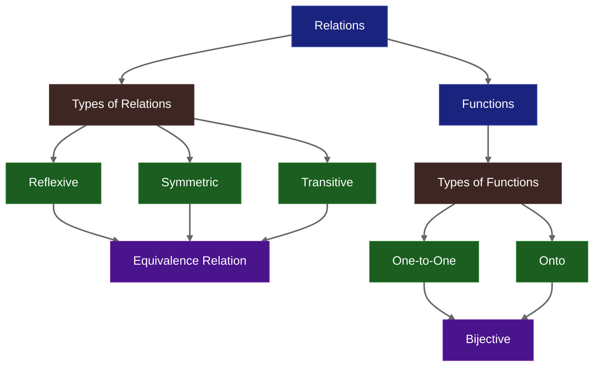

# 📝 Relations & Functions – Quick Revision Cheat Sheet

---

## Visualization - Relations & Functions



This diagram shows:

- Hierarchy of Relations and Functions
- Different types of Relations (Reflexive, Symmetric, Transitive)
- How Equivalence relation combines all three relation types
- Function classifications (One-to-One, Onto, Bijective)
- How Bijective functions combine properties of One-to-One and Onto functions

---

Key points from the diagram:

1. **Relations**: Shows connection between elements of two sets
2. **Reflexive**: Shows self-mapping (a → a)
3. **Symmetric**: When a → b implies b → a
4. **Transitive**: When a → b and b → c implies a → c
5. **Functions**: Special relations where each input has one output
6. **One-to-One Functions**: Each element maps to unique element
7. **Bijective**: Both one-to-one and onto functions combined

## The blue ovals represent sets, and arrows show the mappings between elements.

## 1️⃣ Relation

- **Definition:** A relation is a **connection between elements of two sets**.
- **Notation:** (aRb) means “a is related to b.”
- **Example:** Set A = Students, Set B = Mobile numbers. Connecting each student to their number is a relation.

---

## 2️⃣ Types of Relations

| Relation Type   | Condition                                  | Example          | Real-life Analogy   |
| --------------- | ------------------------------------------ | ---------------- | ------------------- |
| **Reflexive**   | Every element is related to itself ((aRa)) | “is equal to”    | Mirror reflection   |
| **Symmetric**   | (aRb \implies bRa)                         | “is friend of”   | Friendship (mutual) |
| **Transitive**  | (aRb) and (bRc \implies aRc)               | “is ancestor of” | Family chain        |
| **Equivalence** | Reflexive + Symmetric + Transitive         | “has same age”   | WhatsApp group      |

**Visual Diagram Idea:**

```
Reflexive:  a → a
Symmetric:  a → b , b → a
Transitive: a → b , b → c , then a → c
Equivalence: All three together
```

---

## 3️⃣ Functions

- **Definition:** A function is a special relation where **each input has exactly one output**.

---

### Types of Functions

| Function Type              | Condition                              | Example                                   | Analogy                      |
| -------------------------- | -------------------------------------- | ----------------------------------------- | ---------------------------- |
| **One-to-One (Injective)** | Each input → unique output             | Aadhar number → person                    | One person → one fingerprint |
| **Onto (Surjective)**      | Every element in output set is covered | Teachers → Subjects (all subjects taught) | Every cinema seat is filled  |
| **Bijective**              | Both One-to-One & Onto                 | Roll numbers → Students                   | One student → one seat       |

**Visual Diagram Idea:**

```
One-to-One:     a → 1 , b → 2 , c → 3
Onto:           a → 1 , b → 2 , c → 2 (all outputs covered)
Bijective:      a → 1 , b → 2 , c → 3 (one-to-one & onto)
```

---

## 4️⃣ Quick Examples

1. **Reflexive:** 5 = 5
2. **Symmetric:** If A is friend of B → B is friend of A
3. **Transitive:** If A > B and B > C → A > C
4. **Equivalence:** Numbers modulo 5 (difference divisible by 5)
5. **One-to-One Function:** f(x) = 2x + 3 (x ∈ ℝ)
6. **Onto Function:** f(x) = x^3 (x ∈ ℝ)
7. **Bijective Function:** f(x) = 2x + 3 (x ∈ ℝ → y ∈ ℝ)

---

## 5️⃣ Memory Tricks / Analogies

- **Reflexive:** Mirror reflection (self-related)
- **Symmetric:** Friendship (both ways)
- **Transitive:** Family chain (grandparent link)
- **Equivalence:** WhatsApp group (all three properties)
- **One-to-One:** Fingerprint
- **Onto:** Cinema seats filled
- **Bijective:** One student, one seat

---
